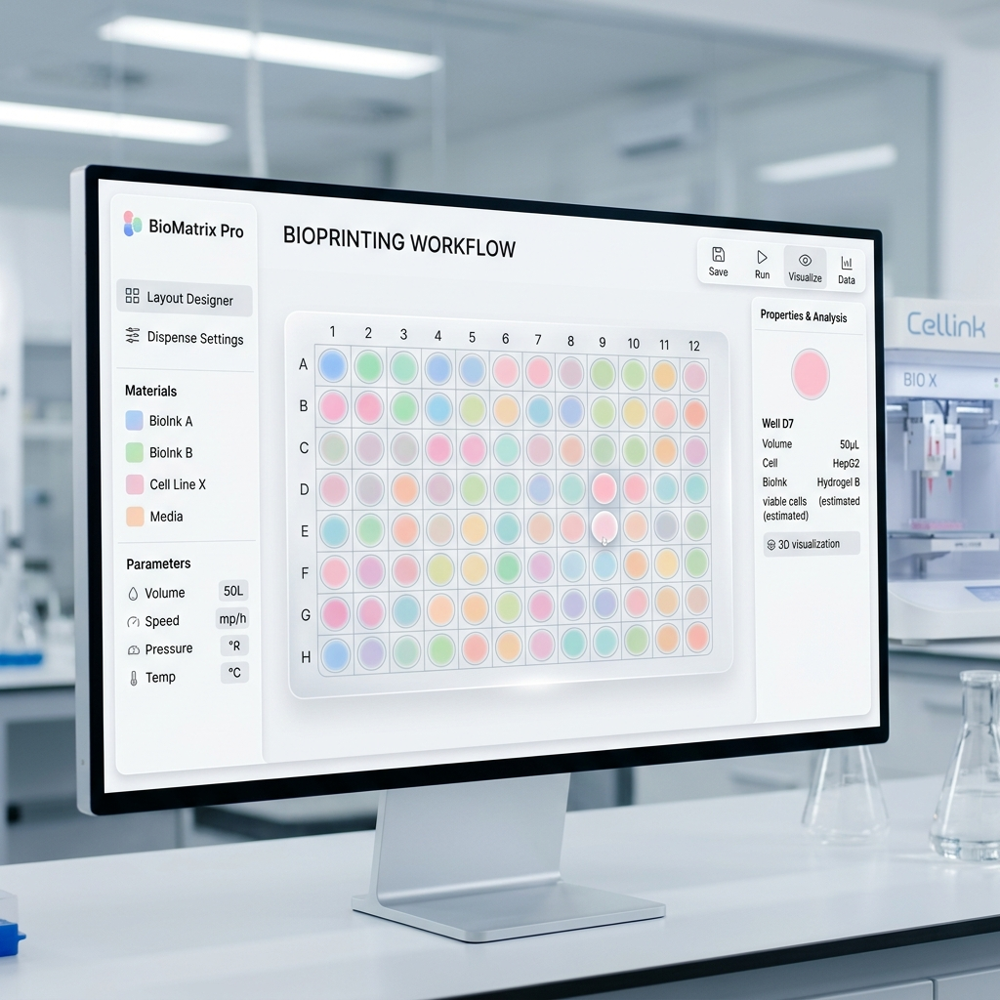

# 🧪 Droplet Lab

**Modern Control Interface for Precision Biomaterial Deposition**

Droplet Lab is a professional, React-based web application designed to orchestrate the deposition of hydrogels, biomaterials, and chemical compounds onto standard laboratory substrates. From multiwell plates to petri dishes, Droplet Lab provides a seamless, wizard-driven workflow to configure sequences and generate G-code for automated dispensing systems.



---

## ✨ Key Features

- **Intuitive Wizard Workflow**: A structured 4-step process designed for laboratory environments:
  1. **Substrate Selection**: Support for standard SBS multiwell plates (6, 12, 24, 48, 96, 384) and virtual-grid elements.
  2. **Machine Configuration**: Fine-tune physical parameters, feedrates, and syringe dimensions.
  3. **Sequence Designer**: Interactive visual selection of deposition points with multi-sequence support.
  4. **Execution & Control**: Real-time G-code generation and hardware communication via Web Serial.

- **Precision Visualization**:
    - **SBS Compliance**: Accurate physical dimensions for all standard plates.
    - **Virtual Grids**: Dynamic grid generation for Petri dishes (60/90mm) and microscope slides.
    - **Safety Boundaries**: Automatic 5mm safety offset for Petri dishes to prevent wall interference.

- **Advanced Sequence Management**:
    - Multi-step sequences with distinct pastel color coding.
    - Volume-specific control per step (µL).
    - Rectangular drag-selection and pattern-based selection (Odd/Even/Rows).
    - Import/Export sequences in JSON format.

- **Hardware Ready**:
    - Integrated **Web Serial API** for direct browser-to-machine communication.
    - Parametric G-code generation compatible with most CNC/3D printer firmwares (Marlin/GRBL).

---

## 🚀 Quick Start

### Prerequisites

- [Node.js](https://nodejs.org/) (v18 or higher)
- A modern browser with Web Serial support (Chrome, Edge, Opera)

### Installation

1. Clone the repository:
   ```bash
   git clone https://github.com/pedrorocca22/Droplet-Lab.git
   ```

2. Navigate to the project directory:
   ```bash
   cd Droplet-Lab
   ```

3. Install dependencies:
   ```bash
   npm install
   ```

4. Launch the development server:
   ```bash
   npm run dev
   ```

---

## 🛠️ Technology Stack

- **Frontend**: [React 18](https://reactjs.org/) + [Vite](https://vitejs.dev/)
- **Animations**: [Framer Motion](https://www.framer.com/motion/)
- **Icons**: [Lucide React](https://lucide.dev/)
- **Styling**: Modern CSS with Glassmorphism and Laboratory Aesthetics
- **Hardware Link**: Web Serial API

---

## 📐 Supported Substrates

| Type | Format | Features |
| :--- | :--- | :--- |
| **Multiwell Plates** | 6, 12, 24, 48, 96, 384 | SBS Standard dimensions, A1-anchored |
| **Petri Dishes** | 60mm, 90mm | Centered virtual grid, 5mm safety offset |
| **Slides** | 75x25mm | virtual grid, cover slip area indication |

---

## 📝 License

This project is developed for research and laboratory automation purposes.

---

> [!IMPORTANT]
> **Beta Version**: This software is currently in active development. Always verify G-code paths in a simulator before running on physical hardware to prevent nozzle/substrate damage.
